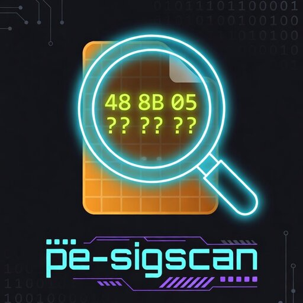

# pe-sigscan

[](#license)
[](https://codecov.io/gh/H0llyW00dzZ/pe-sigscan)
[](https://crates.io/crates/pe-sigscan)
[](https://docs.rs/pe-sigscan)
[](https://deepwiki.com/H0llyW00dzZ/pe-sigscan)

<p align="center">
  
</p>

Fast byte-pattern ("signature") scanning over the executable sections of a
loaded PE module on Windows, with both in-process and reader-backed
out-of-process scanning APIs.

A small, dependency-free building block for game mods, hookers, debuggers,
remote memory tools, and any other workflow that needs to locate
non-exported, non-vtable-accessible code by its byte signature.

## Features

- **IDA-style wildcard patterns**, parsed from a string at runtime
  (`Pattern::from_ida("48 8B 05 ?? ?? ?? ?? 48 89 41 08")`) or built at
  compile time with the `pattern!` macro (no allocation).
- **Two scanning modes**: walk only the section literally named `.text`, or
  walk every section whose `IMAGE_SCN_MEM_EXECUTE` characteristic is set
  (required for some compilers / linkers that split code into companion
  sections like `.text$mn`).
- **Section-targeted scanning** (optional, `section-info` feature). Lifts
  the `.text` / executable-only restriction: `find_in_section`,
  `count_in_section`, and `iter_in_section` scan any named section by
  prefix, so you can locate string literals or vtables in `.rdata`,
  runtime globals in `.data`, exception unwind data in `.pdata`, and so
  on. Zero impact on the default build.
- **`module_size`** (always available) reads `OptionalHeader.SizeOfImage`
  for cross-module rel32 disambiguation when used with the
  `resolve_rel32*` helpers.
- **Hook-install uniqueness**: companion `count_*` functions let you verify
  a pattern matches exactly once before patching, so you never silently
  hook the wrong function.
- **Streaming iteration**: `iter_in_text`, `iter_in_exec_sections`, and
  `iter_in_slice` yield every non-overlapping match address lazily, so
  you can apply per-match filters or patch many call sites in a single
  pass without rolling a manual scan loop.
- **rel32 helpers**: `resolve_rel32` / `resolve_rel32_at` package the
  off-by-one-prone `next_ip + disp32` arithmetic that follows nearly
  every signature match in x64 code (RIP-relative `mov`, `call rel32`,
  `jmp rel32`).
- **Slice variants** (`find_in_slice`, `count_in_slice`, `iter_in_slice`)
  for offline analysis and unit testing without a loaded PE.
- **Reader-backed scanning** for out-of-process backends. Implement
  `MemoryReader` and use `find_in_text_with`, `count_in_text_with`,
  `find_in_exec_sections_with`, `count_in_exec_sections_with`, and
  `module_size_with` for `ReadProcessMemory`, kernel, DMA, or hypervisor
  workflows.
- **Direct memory reads** on the in-process path (no `ReadProcessMemory`
  round-trip per byte) — suitable for scanning tens of megabytes of `.text`
  in well under a second.
- **Vectorized first-byte search**. The hot anchor pre-filter ships in two
  flavours: a portable SWAR (8-byte word) implementation that is the
  default, and an optional `memchr`-backed path that uses runtime-detected
  AVX2 / SSE2 / NEON. See [Performance](#performance) for numbers.
- **`#![no_std]`-compatible**, allocates only when constructing an owned
  `Pattern` from an IDA-style string. The compile-time `pattern!` macro
  produces a `&'static [Option<u8>]` with zero allocation.
- **Zero dependencies by default.** Enabling the optional `memchr` feature
  pulls in a single SIMD-accelerated dependency.

## Quick start

Add the crate to your `Cargo.toml`:

```toml
[dependencies]
pe-sigscan = "0.1"
```

Or, for SIMD-accelerated scans (recommended for cheats / mod loaders):

```toml
[dependencies]
pe-sigscan = { version = "0.1", features = ["memchr"] }
```

Replace `0.1` with the latest published version on crates.io.

### Scanning the loaded process

```rust,no_run
use pe_sigscan::{find_in_text, Pattern};

// Get a module base via your preferred means (GetModuleHandleW, PEB walk, etc.).
let module_base: usize = /* ... */ 0;

// Build a pattern from an IDA-style hex string. `?` and `??` are wildcards.
let pat = Pattern::from_ida("48 8B 05 ?? ?? ?? ?? 48 89 41 08").unwrap();

if let Some(addr) = find_in_text(module_base, pat.as_slice()) {
    println!("matched at {addr:#x}");
}
```

### Scanning through a custom reader

For out-of-process backends such as `ReadProcessMemory`, kernel drivers, DMA,
or hypervisor introspection, implement `MemoryReader` and use the `*_with`
helpers. They copy the target section bytes once into a local scratch buffer,
reuse the same slice scanner as `find_in_slice`, and return the remote
absolute match address.

```rust,no_run
use pe_sigscan::{find_in_text_with, pattern, MemoryReader};

struct Remote;

impl MemoryReader for Remote {
    fn read_bytes(&self, addr: usize, buf: &mut [u8]) -> Option<()> {
        let _ = (addr, buf);
        // Fill `buf` from your backend here.
        None
    }
}

let reader = Remote;
let module_base: usize = /* remote module base */ 0;

const SIG: &[Option<u8>] = pattern![0x48, 0x8B, 0x05, _, _, _, _];
let _ = find_in_text_with(&reader, module_base, SIG);
```

Use the matching companions when needed:

- `count_in_text_with`
- `find_in_exec_sections_with`
- `count_in_exec_sections_with`
- `module_size_with`

With the `section-info` feature:

- `find_in_section_with`
- `count_in_section_with`

### Compile-time patterns

```rust
use pe_sigscan::pattern;

// `_` is the wildcard token; bytes use 0xNN literals.
const SIG: &[Option<u8>] = pattern![0x48, 0x8B, _, _, 0x48, 0x89];
```

### Iterating over every match

When a single pattern intentionally matches multiple call sites (e.g.
patching every `call HeapAlloc`, or logging every reference to a
particular global), use the iterator variants:

```rust,no_run
use pe_sigscan::{iter_in_text, pattern};
# let module_base: usize = 0;

const HOOK_TARGETS: &[Option<u8>] = pattern![0xE8, _, _, _, _]; // call rel32

for addr in iter_in_text(module_base, HOOK_TARGETS) {
    println!("call site at {addr:#x}");
    // … install hook, log, or rewrite at `addr`
}
```

Iterators yield non-overlapping matches (after a hit at offset `i` the
next probe starts at `i + pattern.len()`), so
`iter_in_text(..).count()` always equals `count_in_text(..)`.

### Resolving rel32 displacements

After matching an instruction whose target is a 32-bit RIP-relative
displacement, the next step is almost always "follow the displacement to
its absolute target". `resolve_rel32_at` packages that calculation:

```rust,no_run
use pe_sigscan::{find_in_text, pattern, resolve_rel32_at};
# let module_base: usize = 0;

// mov rax, [rip+disp32]: 48 8B 05 ?? ?? ?? ?? — disp at +3, instr len 7.
const SIG: &[Option<u8>] = pattern![0x48, 0x8B, 0x05, _, _, _, _];
if let Some(addr) = find_in_text(module_base, SIG) {
    let target = unsafe { resolve_rel32_at(addr, 3, 7) };
    println!("global at {target:#x}");
}
```

| Instruction          | Bytes (anchor + disp)        | `rel32_offset` | `instr_len` |
| -------------------- | ---------------------------- | -------------- | ----------- |
| `mov rax, [rip+d32]` | `48 8B 05 ?? ?? ?? ??`       | 3              | 7           |
| `lea rax, [rip+d32]` | `48 8D 05 ?? ?? ?? ??`       | 3              | 7           |
| `call rel32`         | `E8 ?? ?? ?? ??`             | 1              | 5           |
| `jmp rel32`          | `E9 ?? ?? ?? ??`             | 1              | 5           |
| `jcc rel32`          | `0F 8x ?? ?? ?? ??`          | 2              | 6           |

For offline analysis (no loaded PE), `read_rel32(&bytes, offset)` is the
safe slice equivalent that returns the raw `i32` displacement.

### Verifying uniqueness before installing a hook

```rust,no_run
use pe_sigscan::{count_in_text, find_in_text, pattern};
# let module_base: usize = 0;

const TARGET_SIG: &[Option<u8>] = pattern![
    0x48, 0x89, 0x5C, 0x24, _, 0x48, 0x89, 0x74, 0x24, _,
    0x48, 0x89, 0x7C, 0x24, _, 0x55, 0x41, 0x56, 0x41, 0x57,
];

let count = count_in_text(module_base, TARGET_SIG);
match count {
    1 => {
        let addr = find_in_text(module_base, TARGET_SIG).unwrap();
        // … install hook at `addr`
    }
    0 => panic!("pattern not found — game may have been updated"),
    n => panic!("pattern matched {n} sites — refusing to install (ambiguous)"),
}
```

### Walking every executable section

Some compilers and linkers split code into multiple sections (`.text$mn`,
`.textbss`, optimized-layout arenas). Use the `*_in_exec_sections` variants
when the function you're scanning for might not live in the section
literally named `.text`:

```rust,no_run
use pe_sigscan::{find_in_exec_sections, pattern};
# let module_base: usize = 0;

const SIG: &[Option<u8>] = pattern![0x48, 0x8B, _, _, _, _, 0xFF, 0xE0];
let addr = find_in_exec_sections(module_base, SIG);
```

### Scanning a specific section (optional)

Enable the `section-info` feature when the bytes you're after live outside
any executable section — string literals and vtables in `.rdata`, runtime
globals in `.data`, exception unwind data in `.pdata`:

```toml
[dependencies]
pe-sigscan = { version = "0.3", features = ["section-info"] }
```

```rust,no_run
use pe_sigscan::{find_in_section, iter_in_section, pattern};
# let module_base: usize = 0;

// UTF-16LE "Hello" — typical .rdata literal layout.
const HELLO_W: &[Option<u8>] = pattern![
    b'H', 0x00, b'e', 0x00, b'l', 0x00, b'l', 0x00, b'o', 0x00,
];

if let Some(addr) = find_in_section(module_base, b".rdata", HELLO_W) {
    println!("string at {addr:#x}");
}

// Or iterate every match in a chosen section:
const VTBL_ENTRY: &[Option<u8>] = pattern![_, _, _, _, _, _, _, _];
for addr in iter_in_section(module_base, b".rdata", VTBL_ENTRY) {
    let _ = addr;
}
```

Section names are matched against the 8-byte on-disk name field by
prefix, so `b".rdata"` also catches suffix-tagged variants like
`.rdata$zz`.

`module_size` (always available, independent of the `section-info`
feature) reads `SizeOfImage` from the optional header. Useful for
filtering rel32 resolutions that land outside the current module:

```rust,no_run
use pe_sigscan::{module_size, resolve_rel32_at};
# let module_base: usize = 0;
# let match_addr: usize = 0;

if let Some(size) = module_size(module_base) {
    let target = unsafe { resolve_rel32_at(match_addr, 1, 5) };
    if (module_base..module_base + size).contains(&target) {
        // in-module call — proceed
    } else {
        // jumps into another module (e.g. an import thunk) — different handling
    }
}
```

For out-of-process readers, use `module_size_with(&reader, module_base)`.

### Offline analysis (no loaded PE required)

```rust
use pe_sigscan::{find_in_slice, pattern};

let bytes = [0x00, 0x11, 0x48, 0x8B, 0x05, 0x99];
let pat = pattern![0x48, 0x8B, 0x05];
let hit = find_in_slice(&bytes, pat).unwrap();
assert_eq!(hit, bytes.as_ptr() as usize + 2);
```

## Pattern syntax

`Pattern::from_ida` accepts whitespace-separated tokens:

| Token  | Meaning                                |
| ------ | -------------------------------------- |
| `XX`   | Two hex digits — match the literal byte `0xXX`. Case-insensitive. |
| `?`    | Wildcard — match any byte.             |
| `??`   | Wildcard (long form, identical to `?`). |

ASCII whitespace (spaces, tabs, newlines, carriage returns) between tokens is
ignored. Anything else returns a [`ParsePatternError`] with the offending
token's index.

```rust
use pe_sigscan::Pattern;
assert!(Pattern::from_ida("48 8B ?? 89").is_ok());
assert!(Pattern::from_ida("AB CD EF").is_ok());           // upper-case hex
assert!(Pattern::from_ida("ab cd ef").is_ok());           // lower-case hex
assert!(Pattern::from_ida("  48\t??\n89  ").is_ok());     // extra whitespace
assert!(Pattern::from_ida("48 ZZ 89").is_err());          // invalid hex
assert!(Pattern::from_ida("48 8 89").is_err());           // single hex digit
assert!(Pattern::from_ida("").is_err());                  // empty
```

## Performance

Signature scanning is dominated by the inner loop that probes one anchor
byte (the first non-wildcard byte of the pattern) at every candidate
offset. This crate ships two implementations of that hot path:

- **SWAR (default)** — portable 8-byte word search using the standard
  "has-zero-byte" bit-twiddle. Pure no_std Rust, no dependencies, works on
  every target rustc supports.
- **memchr (`memchr` feature)** — delegates the anchor scan to the
  [`memchr`](https://crates.io/crates/memchr) crate, which performs runtime
  CPU feature detection and uses AVX2 / SSE2 on x86_64 and NEON on aarch64.

### Benchmark numbers

The bench (`benches/scan.rs`, criterion) searches an 8-byte pattern with one
wildcard (`48 8B 05 ? ? ? ? 48`) inside a 1 MiB buffer of zeros — a worst
case where the anchor byte never matches and the inner loop has to traverse
the entire haystack.

| Backend | `find_in_slice` (1 MiB) | `count_in_slice` (1 MiB) | vs. naive |
| --- | --- | --- | --- |
| Naive byte-by-byte (pre-fastscan) | ~662 µs | ~331 µs | 1× |
| SWAR fallback (default features) | ~102 µs | ~99 µs | **6.5× / 3.3×** |
| memchr (`--features memchr`) | **~10 µs** | **~10 µs** | **63× / 32×** |

Numbers from a Windows 11 / x86_64 box; the relative gap holds on Linux and
macOS. Run `cargo bench` (default backend) or
`cargo bench --features memchr` to reproduce.

### When to enable `memchr`

Enable it when scan throughput matters — typically in-process tooling that
sweeps tens to hundreds of megabytes per pass:

- Internal cheat / mod loaders scanning `client.dll` (~30–60 MB) or
  `GameAssembly.dll` (50–200 MB) at injection time.
- Anti-cheat-aware code that wants to keep the CPU spike short.
- Test harnesses re-running 100+ signatures after every game update.

```toml
[dependencies]
pe-sigscan = { version = "0.1", features = ["memchr"] }
```

For one-shot offline tools (Ghidra/IDA scripts, sig-dev REPLs), the default
SWAR path is already 3–6× faster than naive and you can keep the crate
dependency-free.

## Use Cases

`pe-sigscan` can be used in a wide range of scenarios that require locating
code or data inside PE modules:

### Game Modding & Internal Tools
- Finding function addresses to hook in `.text` or other executable sections
- Signature-based offset scanning (instead of hardcoding addresses)
- Verifying pattern uniqueness before installing hooks using the `count_*` functions
- Locating string literals, vtables, and configuration tables in `.rdata`
  via the `section-info` feature (e.g. fingerprinting a specific game
  build by a known UTF-16LE error message)

### Reverse Engineering
- Quickly locating functions and data structures without relying on debug symbols
- Building custom signature databases for repeated binary analysis
- Supporting IDA/Ghidra-style workflows programmatically
- Cross-module rel32 disambiguation with `module_size` (in-module call vs.
  call into an import thunk vs. tail-call into another module)

### Malware Analysis & Security Research
- Detecting known malicious code patterns or unpacker stubs
- Identifying anti-debug, anti-VM, or evasion techniques
- Automated scanning in sandboxes, analysis pipelines, or security tools

### Development & Debugging Tools
- Custom memory scanners and runtime debuggers
- Binary patching and modification utilities
- Runtime function redirection or hooking frameworks

### Offline Analysis
- Scanning PE files directly from disk using `find_in_slice` without loading them into memory
- Useful for static analysis tools and automated signature checkers

## Why direct memory reads?

The `.text` section of a loaded DLL is page-aligned, RX-protected, and stays
committed for the lifetime of the module. There is no TOCTOU concern; bytes
don't change between reads. A typical scan walks tens of megabytes — routing
every probe through `ReadProcessMemory` would cost tens of millions of
syscalls (minutes of wall time). This crate reads directly via raw pointer
dereference, bounded to PE-declared section ranges.

## Safety

The public scanning functions take a `module_base: usize` you obtain from
the OS (e.g. `GetModuleHandleW`). The implementation parses the PE headers
at that base before any other access, so a non-PE pointer is rejected
cleanly. Inside the validated section ranges, the unsafe pointer reads are
bounded by the `VirtualSize` field from the section header — outside the
loader handing us a malformed PE (which the loader itself would have
rejected), there is no path to an out-of-bounds read.

The slice variants (`find_in_slice`, `count_in_slice`) are safe by Rust's
slice invariants and need no further trust from the caller.

## Platform

Windows / PE only.

The crate compiles on every platform — the parsing is pure compute — but
the in-process function signatures assume a `module_base` that came from
the Windows loader. On non-Windows targets, the slice variants
(`find_in_slice`, `count_in_slice`) still work for analyzing PE bytes you
have mapped manually.

## MSRV

Rust 1.70.

## Legal

`pe-sigscan` is a low-level byte-pattern scanning primitive.  
See [LEGAL.md](LEGAL.md) for notes on legitimate use, jurisdictional
considerations, and the project's disclaimer.

## License

Licensed under either of

- Apache License, Version 2.0 ([LICENSE-APACHE](LICENSE-APACHE) or
  <http://www.apache.org/licenses/LICENSE-2.0>)
- MIT license ([LICENSE-MIT](LICENSE-MIT) or
  <http://opensource.org/licenses/MIT>)

at your option.

## Contribution

Unless you explicitly state otherwise, any contribution intentionally
submitted for inclusion in the work by you, as defined in the Apache-2.0
license, shall be dual licensed as above, without any additional terms or
conditions.
